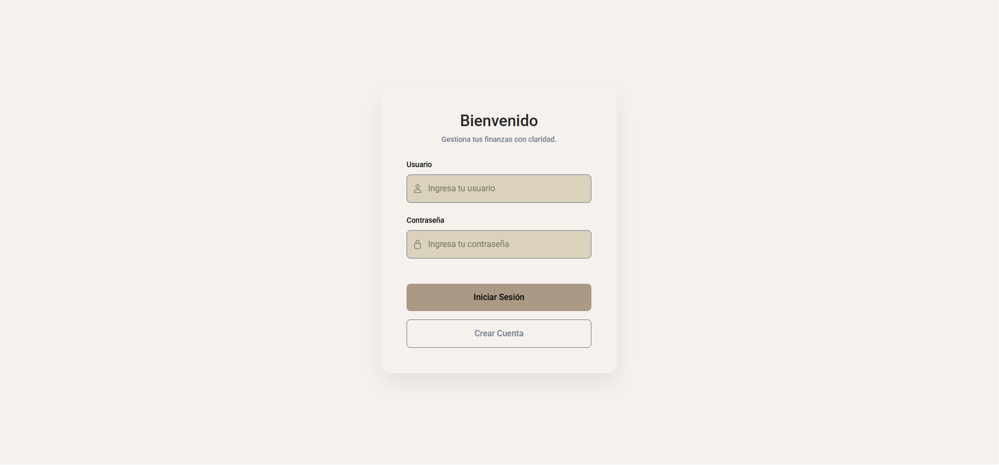
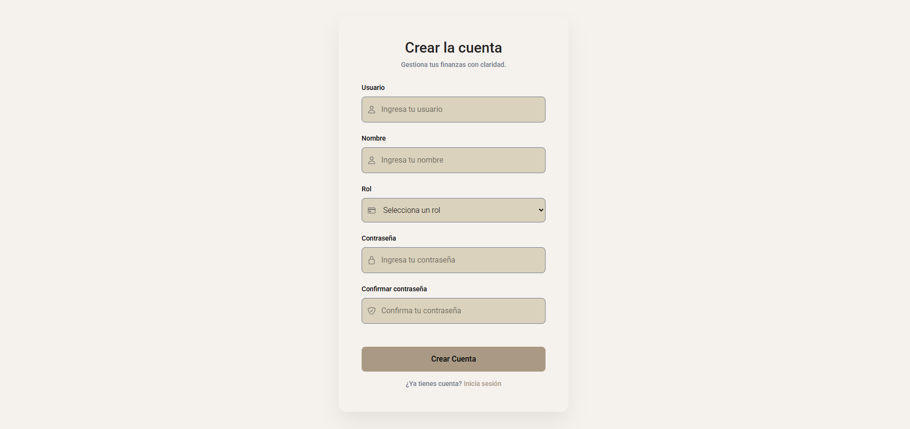
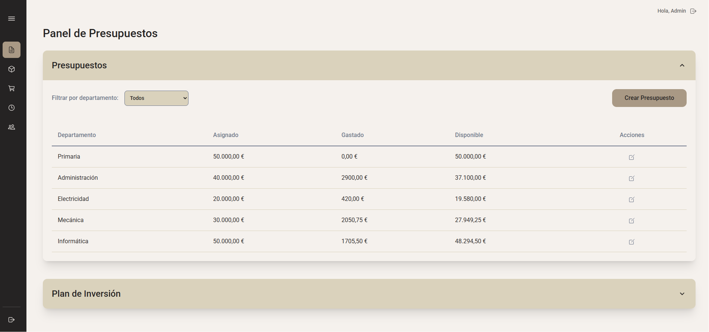
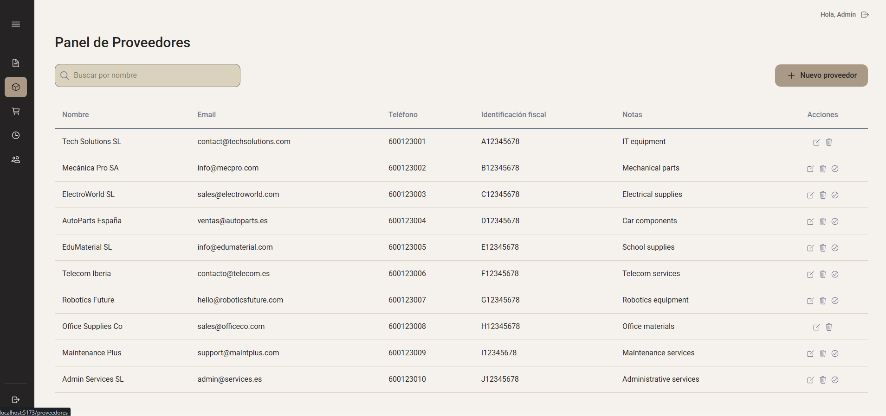
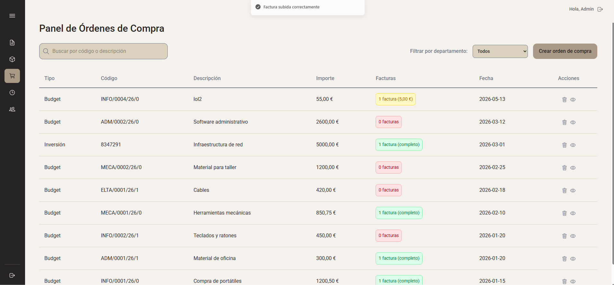
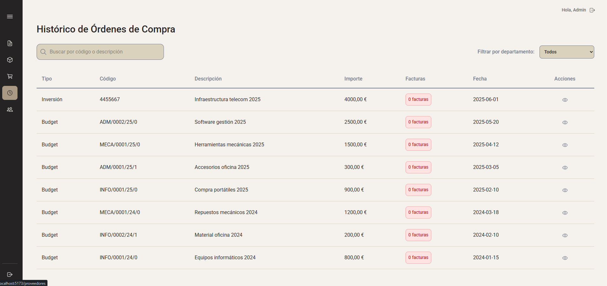
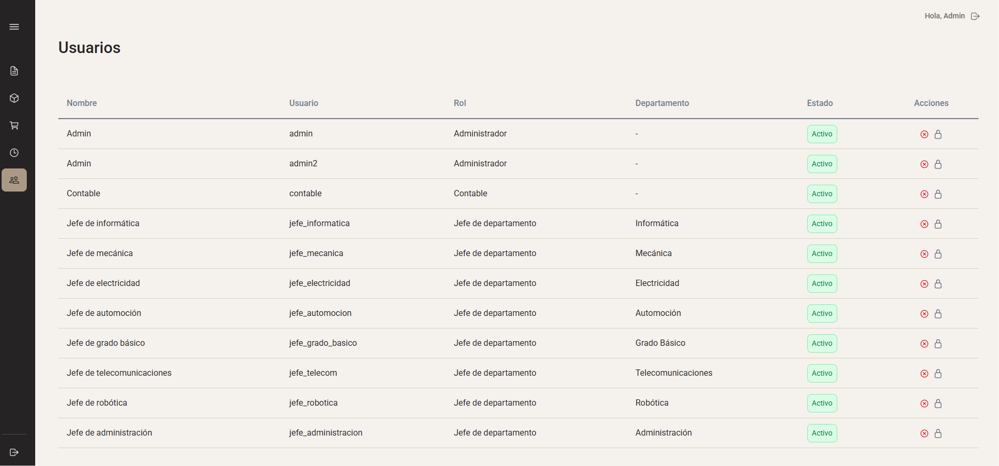
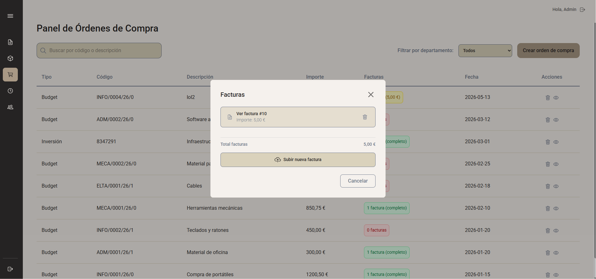

# BudgetManager

BudgetManager is a web application for managing departmental budgets, suppliers, purchase orders, invoices, historical orders, and user accounts. The app is designed for organisations where different users need different levels of access depending on their role.

The interface is in Spanish and the main sections are:

- Presupuestos
- Proveedores
- Órdenes de Compra
- Histórico
- Usuarios

## User roles

The app supports three user roles:

| Role               | Access                                                                                                                 |
| ------------------ | ---------------------------------------------------------------------------------------------------------------------- |
| Administrator      | Full access to all pages and management actions. Can create, edit, delete, assign, approve users, and reset passwords. |
| Accountant         | Can view data, but cannot modify records.                                                                              |
| Head of Department | Can manage data related to their own department, depending on the section.                                             |

## Login

The login page allows existing users to access the system using their username and password.

Main behaviour:

- Checks the username and password with the backend.
- Creates a session when the account is valid and active.
- Shows an error message when credentials are incorrect.
- Shows an error message when the account is inactive.
- Allows users to navigate to the registration page.

## Sign up

The sign-up page allows new users to create an account.

The form includes:

- Username
- Name
- Role
- Password
- Password confirmation
- Department, only when the selected role is Head of Department

The form validates required fields and checks that both passwords match. After registration, the account is stored in the system and can later be managed by an administrator.

## Budget panel

The budget panel displays the organisation's financial data.

It is divided into two sections:

- Presupuestos
- Plan de Inversión

Each table shows:

- Department
- Allocated amount
- Spent amount
- Available amount

Users can select a year and view the corresponding budget records.

Access depends on the user role:

- Administrators and accountants can filter by department.
- Department heads only see information for their own department.
- Users with permission can edit the allocated amount directly in the table.
- Users with permission can create new budget or investment plan records.

The system validates entered values and prevents duplicate budgets for the same department, year, and type.

## Suppliers page

The suppliers page displays supplier records in a table.

Each supplier includes:

- Name
- Email
- Phone
- Tax ID
- Notes

Main actions:

- Search suppliers by name.
- Create new suppliers.
- Edit existing supplier information.
- Delete suppliers, for administrators.
- Assign suppliers to departments.
- Assign suppliers to the user's own department, for department heads.

Suppliers can be shared or restricted to specific departments. This controls which suppliers can be used when creating purchase orders.

## Purchase orders page

The purchase orders page shows purchase orders from the current year.

Each order includes:

- Code
- Description
- Department
- Supplier
- Amount
- Related invoices

Users can:

- Search purchase orders by code or description.
- Filter orders by department, if they are administrators.
- Create a new purchase order, if they have permission.
- Open an order to view more details.
- Upload, view, or delete invoices when allowed.

When creating an order:

- The user selects whether the order uses the standard budget or the investment plan.
- If the standard budget is selected, the system generates the purchase order code automatically.
- If the investment plan is selected, the user must enter a valid investment plan reference.
- The system links the order to the selected department, supplier, budget type, and user.

## Historical orders page

The historical orders page shows purchase orders from previous years.

This section works like the purchase orders page, but it is read-only.

Users can:

- Search by code or description.
- Filter by department, if they are administrators.
- Open an order to view its details.
- View linked invoices.

Users cannot:

- Create new orders.
- Upload new invoices.
- Delete invoices.
- Modify historical records.

## Users page

The users page is only available to administrators.

It displays all registered users with:

- Name
- Username
- Role
- Department
- Status

Administrators can:

- Approve pending users.
- Reject accounts.
- Deactivate active users.
- Reactivate inactive users.
- Reset user passwords through a popup form.

After each action, the table updates automatically and the app shows a success or error message.

## Invoices

Invoices are managed from the purchase order invoice popup.

Users can:

- Upload PDF invoices.
- Enter the invoice amount.
- Open uploaded invoices in a new tab.
- Delete invoices when allowed.

The system validates:

- The uploaded file must be a PDF.
- The invoice amount must be valid.
- The invoice amount must be greater than zero.
- The file size must be within the accepted upload limit.

In the historical section, invoices can only be viewed, not modified.

## Main workflow

A typical workflow in the app is:

1. An administrator creates or updates the budgets and investment plans for the year.
2. Suppliers are created and assigned to departments.
3. A user creates a purchase order using either a budget or an investment plan.
4. The system updates the spent and available amounts.
5. Invoices are uploaded and linked to the purchase order.
6. Older orders are later displayed in the historical section.

## Data managed by the app

BudgetManager manages the following main data:

| Data type       | Purpose                                                                          |
| --------------- | -------------------------------------------------------------------------------- |
| Users           | Stores application users, roles, departments, and account status.                |
| Departments     | Organises budgets, users, suppliers, and purchase orders.                        |
| Budgets         | Stores allocated, spent, and available money by department, year, and type.      |
| Suppliers       | Stores supplier contact and tax information.                                     |
| Purchase orders | Stores procurement records linked to budgets, suppliers, departments, and users. |
| Invoices        | Stores PDF invoice files linked to purchase orders.                              |
